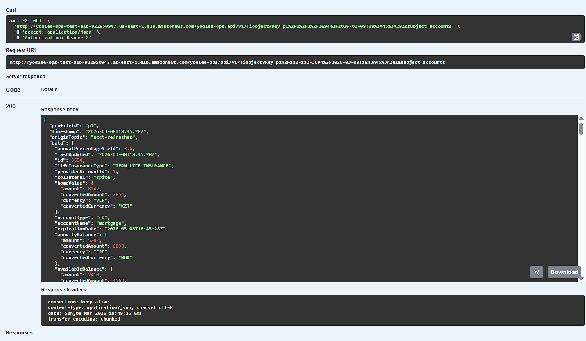
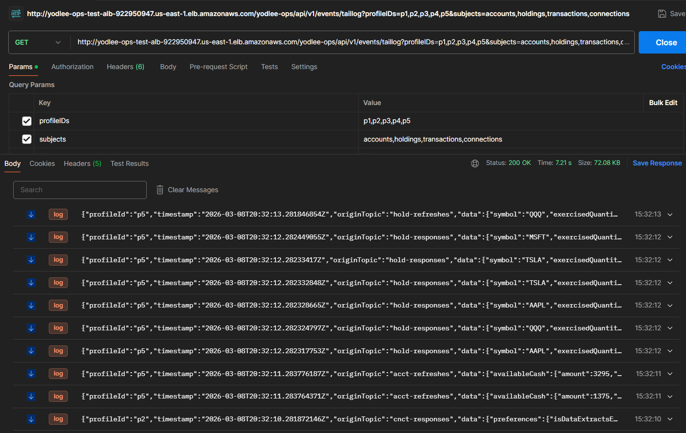
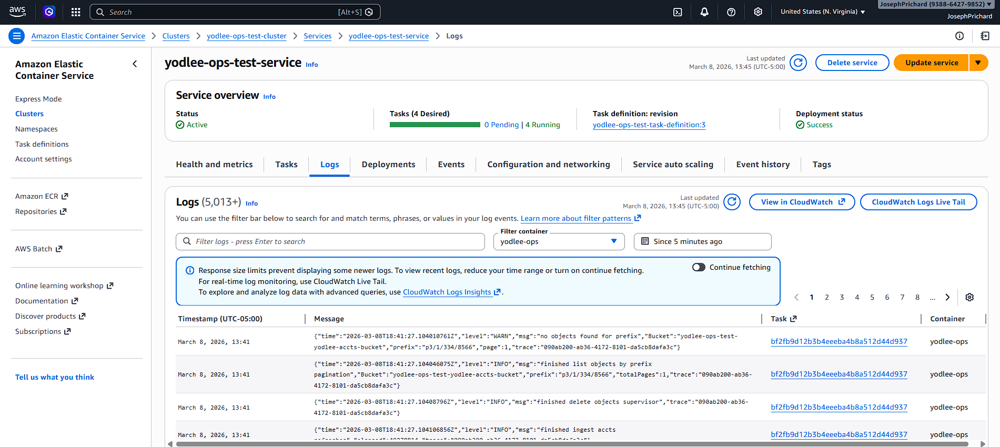
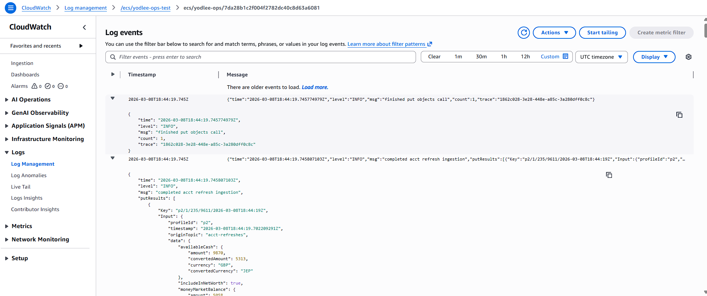
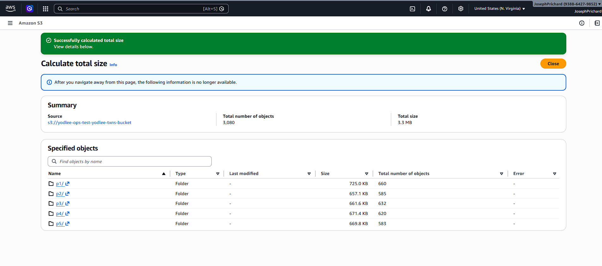

# Yodlee Ops
Microservice to ingest yodlee responses to S3 through message queues. 
Contains a small REST API for common queries and an SSE endpoint to stream ingested data for specific profile IDs.

## Problem Statement

Yodlee, the financial data aggregation plaform has an API for consuming information that contains the logical concept of connections, accounts, transactions, and holdings.
Suppose there is another microservice that uses Yodlee's API to receive customer data for these 4 datatypes. 
We need a way to log every response received from Yodlee and store it in an ultra long-term inexpensive storage (S3) for future access.
Additionally, we need to delete any customer records marked as deleted, as well as child records (if a connection is deleted, all of its accounts, transactions, and holdings must also be deleted).

## Configuration

Environment Variables
```.env
AWS_SECRET_ID=test
AWS_SECRET_KEY=test
AWS_DEFAULT_REGION=us-east-1
AWS_ENDPOINT=http://localhost:4566
KAFKA_BROKERS=localhost:9092
CNCT_BUCKET=yodlee-cncts-bucket
ACCT_BUCKET=yodlee-accts-bucket
TXN_BUCKET=yodlee-txns-bucket
HOLD_BUCKET=yodlee-holds-bucket
```

Create a '.env' file at the root for local development or pass them as arguments when deploying.

## Development

Build

`$ make install && make`

Execute

`$ go run cmd/server/main.go`

## Deployment

Project contains configs for two environments, test and uat. 
Both of these are test environments, but the uat environment contains more tasks and more powerful ECS task instances.
For the most part, multienvironment setup exists as a POC for quickly replicating the terraform config to different environments.

Deployment to the test environment is done through GitHub actions. Refer to `.github/workflows/deploy.yml`.
The pipeline is split into CI and CD stages. 
The CI stage runs the integration tests, builds the docker image, and publishes it.
The CD stage uses terraform apply to update the infrastructure if needed, then deploys the app by creating a new ECS task definition.

The test deployment triggers on `test` branch and uat deployment on `main` branch.

AWS architecture definition is self-contained except needing an ECR repository (configured to be `development/yodleeops`).
The terraform deployment creates the VPC, subnets, ECS cluster, S3 buckets, MSK cluster, ALB, ECS service, IAM roles, IAM policies, security configurations, and the ECS task definition.





